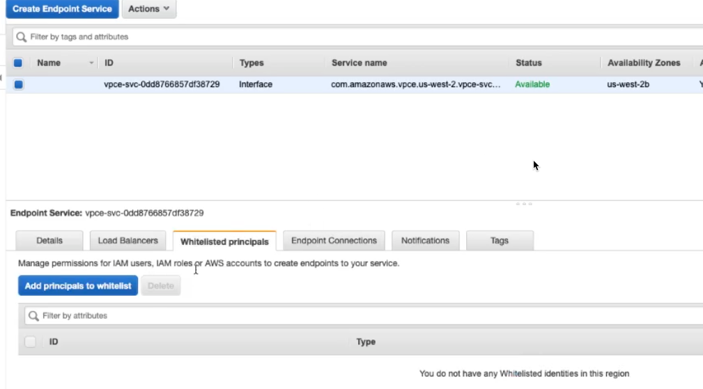
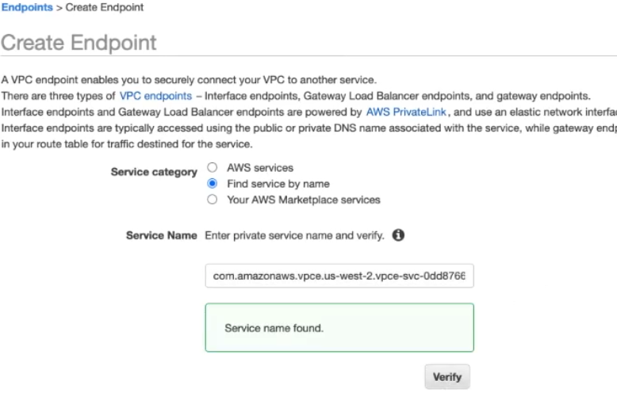
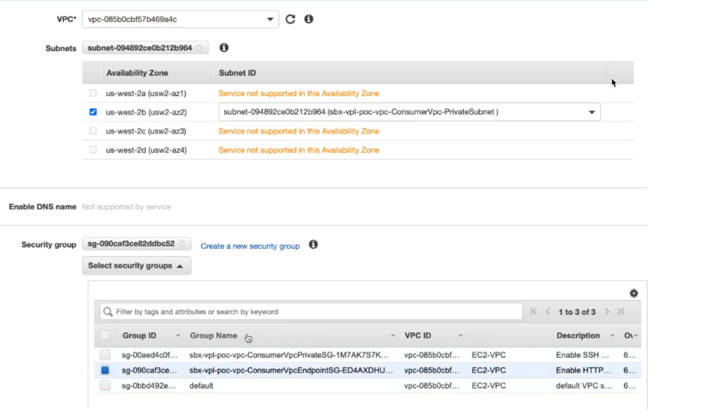

# Cloud Engineering Private Link POC

This document describes the steps to create an AWS Privatelink endpoint in a "Service" VPC and then share that endpoint in a "Consumer" VPC.

The GIT repo for this poc is located here: [Cloud Engineering Privatelink POC Repo](https://github.mmm.com/3MHISCloudEngineering/privatelink-poc)

## Steps to create POC resources

1) Upload or create a keypair
- You can use an existing keypair if you have one available

```

make key_name=cloud-eng-test \
    key_file_path=/Users/aazpszz/.ssh/cloud-eng-test.pub \
    import-keypair

make -s describe-keypairs
aws ec2 describe-key-pairs \
    	--profile sandbox --region us-west-2 \
		--query "KeyPairs[*].{KeyName:KeyName}" \
		--output text
cloud-eng-test    

```

2) Create EC2 Instance Role for SSM Login

```

make create-instance-profile-stacks

```

3) Update Parameters for VPC Stacks

- [service-parameters.json](Cloudformation/parameters/service-parameters.json) 
- [consumer-parameters.json](Cloudformation/parameters/consumer-parameters.json) 


4) Launch VPC Stacks

```

make create-privatelink-stacks


```


## Examine Service VPC resources

1) Service VPC webserver instance only has pubic IP and it's in a private subnet.      

   
   


2) The security group for the webserver only allows port 80.   
   

3) This is the webserver routing table.    
   

4) This is the VPC endpoint security group used here for both the AWS SSM endpoints and the Privatelink endpoint service.   
   

5) We need to copy the endpoint service name.   
   

6) Verify that the webserver is running correctly on the webserver instance.   
   

   

7) The consumer ec2 instance only has a privare IP.   
   

8) Security group for consumer instance does not require any inboud rules.    
   

9) Routing for the consumer instance is local only.   
   

10) VPC Endpoint Security group is used for both AWS service enpoints and Privatelink endpoint   
   

11) Attempt to create the endpoint fails because this account/user is not authorized to used the service.   
   

12) Whitelist the consumer account in the Service VPC    
-arn:aws:iam::aws-account-id:root.   
    
   
     

13) Endpoint is accepted now.   
   

14) Setup Consumer VPC, Subnet(s), Security Groups. Cick "Create Endpoint"   
   

15) In Service VPC, accept endpoint request   
   

16) Wait for endpoint status to change from Pending to Available.   
   
   

17) Copy endpoint DNS name from consumer console   
   

18) Test consumer instance against endpoint DNS   
   


## Notes

1) Find availability zones

```

pip3 install boto3
scripts/get-availability-zones-per-region.py

```


## Issues

### This is just a POC

This POC demonstrates how setup a Privatelink vpc services. It is not Production quality. Currently it demonstrates https vs. https.

### Service Availability

The VPC privatelink service should be provided in at least two availability zones and probably in all availability zones.

### PrivateLink Sharing from VPC

This POC assumew we want to share the service from the workload VPC. We could also share the service from the Regional transit gateway.

### Private DNS Name for Privatelink Service

We could create a private DNS name for the privatelink service.

### Using NLB with ALB

If we need to setup an NLB in front of an ALB, we would need to use a lambda to update the NLB targets when the ALB IP changes

### PPV2

PPV2 can be enabled to determine where requests are comming from/usage.

### Costs for Privatelink

https://aws.amazon.com/privatelink/pricing/

us-east-1 Region:

$0.01/hour per endpoint
$0.01/GB


### How Can we Connect Services from a Network

1) Requirements
- VPC endpoint setup in a VPC
- Routing setup to VPN for that VP
- 3M Firewall must be open for that VPC/Port

2) Cloud Ops is considering using Privatelink centralized in in the regional VPCs.

